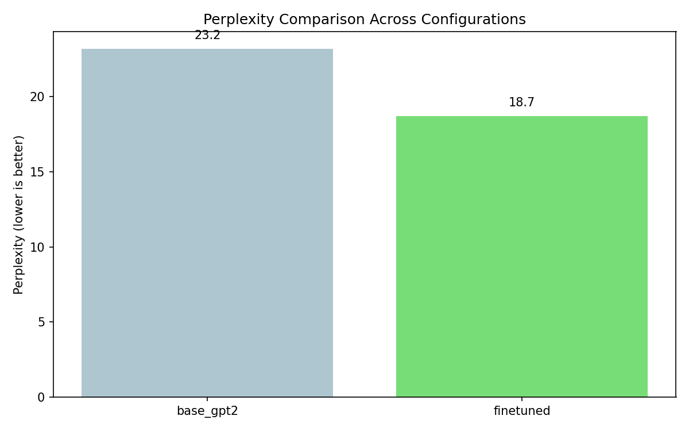

# gita-lm

Fine-tuning a language model to generate Bhagavad-gita commentary in the voice of A.C. Bhaktivedanta Swami Prabhupada — built from scratch, runs entirely locally, no API calls.

This project combines four core techniques from modern LLM development into one pipeline:

1. **LoRA fine-tuning** — implemented from scratch in PyTorch (not the `peft` library)
2. **Retrieval-Augmented Generation (RAG)** — semantic retrieval over 700+ verses
3. **Reward modeling** — a learned scoring head that reranks generated candidates
4. **Experiment tracking & benchmarking** — MLflow logging and quantitative comparison

---

## Why this project

Most "AI" portfolio projects are thin wrappers around the OpenAI or Anthropic API. This one trains an actual model. Every component — the low-rank adaptation math, the training loop, the retrieval layer, the reward head — is implemented and runnable on a laptop with no external services.

The dataset is 625 Prabhupada commentaries across all 18 chapters of the Bhagavad-gita, sourced from a companion project, [gita-insight-engine](https://github.com/Aryag1507/gita-insight-engine).

---

## Architecture

```
                  ┌─────────────────────────────────────────────┐
                  │              SQLite (gita.db)                │
                  │   625 Prabhupada commentaries + verses       │
                  └───────────────────┬─────────────────────────┘
                                      │
              ┌───────────────────────┼───────────────────────┐
              ▼                       ▼                       ▼
      ┌──────────────┐       ┌────────────────┐      ┌────────────────┐
      │  Data prep   │       │  RAG indexing  │      │  Reward model  │
      │  + masking   │       │  (ChromaDB)    │      │  training      │
      └──────┬───────┘       └───────┬────────┘      └───────┬────────┘
             ▼                       │                       │
   ┌──────────────────┐             │                       │
   │  LoRA fine-tune  │             │                       │
   │  (from scratch)  │             │                       │
   └────────┬─────────┘             │                       │
            │                       │                       │
            └───────────┬───────────┴───────────┬───────────┘
                        ▼                       ▼
                ┌───────────────────────────────────────┐
                │           Inference (generate.py)      │
                │  fine-tuned model → RAG context →      │
                │  N candidates → reward rerank → best   │
                └───────────────────────────────────────┘
```

---

## Core technique: LoRA from scratch

Instead of updating all 124M parameters of GPT-2, LoRA freezes the pretrained weights and injects two small trainable matrices into each attention projection:

```
W_adapted = W_frozen + (B @ A) * (alpha / rank)

  A ∈ R^(rank × d_in)   initialized with Kaiming uniform
  B ∈ R^(d_out × rank)  initialized to zero  →  ΔW = 0 at step 0
```

With rank 8, this trains **442,368 parameters — 0.35% of the model**. The result: fast training on Apple Silicon, no catastrophic forgetting, and a small adapter file instead of a full model copy.

GPT-2 uses HuggingFace's `Conv1D` layer (weights stored transposed vs `nn.Linear`), so the implementation in [`src/lora/lora.py`](src/lora/lora.py) handles that explicitly.

---

## Parametric vs non-parametric knowledge

This project deliberately combines two complementary paradigms:

| | Fine-tuning (parametric) | RAG (non-parametric) |
|---|---|---|
| **Stores knowledge in** | Model weights | External vector DB |
| **Provides** | Prabhupada's *style* and vocabulary | Relevant *factual content* per verse |
| **Updated by** | Gradient descent | Re-indexing documents |

The benchmark measures whether combining them beats either alone.

---

## Setup

```bash
git clone https://github.com/Aryag1507/gita-lm.git
cd gita-lm
pip install -r requirements.txt
```

Requires the `gita.db` SQLite database from [gita-insight-engine](https://github.com/Aryag1507/gita-insight-engine). Set its path in [`config.py`](config.py).

---

## Usage

**Train the LoRA adapter:**
```bash
python train.py --epochs 10 --rank 8
```
Logs hyperparameters, per-step loss, and per-epoch perplexity to MLflow. Saves the best adapter by validation perplexity.

**Generate a commentary:**
```bash
python generate.py --chapter 2 --verse 47
```
Retrieves relevant context (RAG), generates 4 candidates, reranks them with the reward model, and prints the best.

**Run the full benchmark:**
```bash
python benchmark.py
```
Compares base GPT-2 vs fine-tuned vs +RAG vs +reward reranking on the held-out test set. Outputs a perplexity chart and qualitative side-by-side examples to `results/`.

**Inspect experiments:**
```bash
mlflow ui
```

---

## Results

Evaluated on a held-out test set of 63 verses the model never saw during training.

### Quantitative: perplexity

Perplexity measures how "surprised" the model is by the real commentary text — lower is better.

| Model | Test perplexity ↓ |
|---|---|
| Base GPT-2 (124M) | 23.18 |
| **+ LoRA fine-tuning** | **18.68** |

The LoRA adapter (1.8 MB, 0.35% of parameters) cuts perplexity by **~19%**, trained entirely on CPU.



### Qualitative: base vs fine-tuned

The clearest difference shows up in generation. On verses with Sanskrit context, the **base model degenerates into repeated Devanagari characters**, while the **fine-tuned model produces coherent English in Prabhupada's register** — invoking Kṛṣṇa consciousness, Vedic theology, and the material/spiritual distinction.

**BG 4.20** — *"Abandoning all attachment to the results of his activities..."*

> **Base GPT-2:** `वीनत्वा क्रिजिक सेटनित्रिक्र प्नाश्रप्र ह्रोत्स जेन्माय्ह्र...` (collapses into Sanskrit-character noise)
>
> **Fine-tuned:** *"This is the position taken by the Vedic theologians. They say that one should not abandon all attachment to the results of his activities... the result is to be treated in terms of the material conditions, and not by the spiritual ones."*

On this verse the theological vocabulary density rose from **0.0 → 0.087** after fine-tuning.

### Honest limitations of these outputs

The fine-tuned generations are on-topic and stylistically correct but **repeat phrases** ("Weather in the celestial world is like the weather in the celestial world..."). This is expected: GPT-2 is small (124M), trained briefly in low-resource mode, and greedy decoding loops easily on small models. Reducing exactly this kind of degeneration is the motivation for the **reward reranking** and **DPO alignment** stages in the pipeline — the repetition is the problem the rest of the project is built to address.

---

## Project structure

```
gita-lm/
├── config.py                   # All hyperparameters (dataclasses)
├── train.py                    # CLI: fine-tune
├── generate.py                 # CLI: inference with RAG + reward reranking
├── benchmark.py                # CLI: full benchmark
└── src/
    ├── data/dataset.py         # Loading, prompt formatting, masked tokenization
    ├── lora/lora.py            # LoRA from scratch (Conv1D adapters)
    ├── training/trainer.py     # Training loop + MLflow + perplexity
    ├── rag/retriever.py        # Embeddings + ChromaDB semantic retrieval
    ├── reward/reward_model.py  # Scalar reward head + heuristic scoring + reranking
    └── evaluation/evaluate.py  # Benchmarking, qualitative comparison, plots
```

---

## Tech

`PyTorch` · `HuggingFace Transformers` · `sentence-transformers` · `ChromaDB` · `MLflow` · GPT-2

## Limitations

GPT-2 (124M) is small by modern standards. It captures Prabhupada's vocabulary and structure well for short commentary, but for long-form coherence a larger base model (Llama 3.2, Mistral) would improve quality — the LoRA implementation here is base-model agnostic and would port directly.
